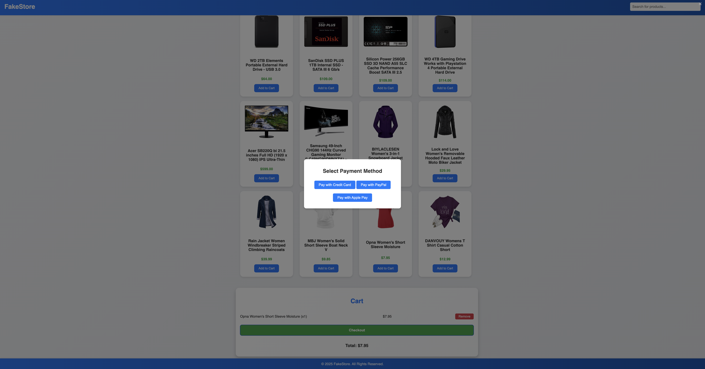

# FakeStore: Deine digitale Shopping-Welt

Auf der Webseite **FakeStore** findest du eine Vielzahl von Produkten, die dynamisch über eine API geladen werden. Die Seite bietet ein modernes und benutzerfreundliches Design sowie folgende Funktionen:



## Funktionen:

- **Intelligente Filter und Sortierung:**
  Produkte können nach Kategorien gefiltert und nach Preis sortiert werden – wahlweise aufsteigend oder absteigend.

- **Interaktive Warenkorb-Funktion:**
  Füge Produkte einfach per Klick deinem Warenkorb hinzu oder entferne sie wieder. Der Gesamtpreis wird automatisch berechnet und in Echtzeit angezeigt.

- **Flexible Zahlungsmethoden:**
  Ein eingebundenes Zahlungsmodul ermöglicht es dir, zwischen verschiedenen Zahlungsmethoden wie Kreditkarte, PayPal oder Apple Pay zu wählen.

- **Intuitives Design:**
  Die übersichtliche Benutzeroberfläche macht das Einkaufen zum Vergnügen – egal, ob du nach Elektronik, Schmuck oder Kleidung suchst.

## Technologien:

- **HTML & CSS** für das responsive Design
- **TypeScript** für die Interaktivität und API-Anbindung
- **FakeStore API** zur Bereitstellung der Produktdaten

## Installation:

1. Clone dieses Repository:
   ```bash
   git clone <repository-url>
   ```
2. Navigiere in das Projektverzeichnis:
   ```bash
   cd <projektordner>
   ```
3. Installiere die Abhängigkeiten (falls erforderlich):
   ```bash
   npm install
   ```
4. Starte das Projekt:
   ```bash
   npm start
   ```

## Vorschau:

Erlebe jetzt den **FakeStore** und genieße ein erstklassiges Online-Shopping-Erlebnis!
